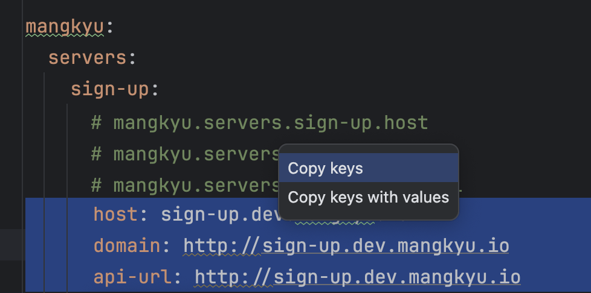
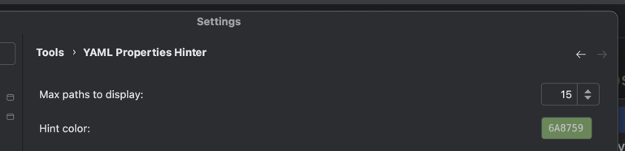

# YAML Properties Hinter

> IntelliJ plugin that displays the full dot-notation property path for YAML keys

When working with deeply nested YAML config files like Spring Boot's `application.yml`, it's hard to tell the full property path of the key you're looking at. YAML Properties Hinter shows the complete path as an inlay hint right above the current line.

## Features

### Full path display

Shows the dot-notation path of the YAML key at the cursor as an inlay hint.

### Multi-line selection

Select multiple lines to see all property paths at once.

### Click to copy

Click the hint to copy the path. Keys with values show a chooser: "Copy keys" / "Copy keys with values".

### Customizable

Configure hint color and max display count in **Settings > Tools > YAML Properties Hinter**.

| Option | Description | Default |
|--------|-------------|---------|
| Max paths to display | Maximum number of paths shown for a selection | 10 |
| Hint color | Color of the hint text | `#6A8759` |

## Installation

### JetBrains Marketplace

Search for "YAML Properties Hinter" in **Settings > Plugins > Marketplace**

### Manual

1. Download the zip from [Releases](https://github.com/mangkyu/yaml-properties-hinter-intellij-plugin/releases)
2. **Settings > Plugins > ⚙️ > Install Plugin from Disk** and select the zip

## Compatibility

- IntelliJ IDEA 2024.1+
- Requires YAML plugin (bundled by default)
